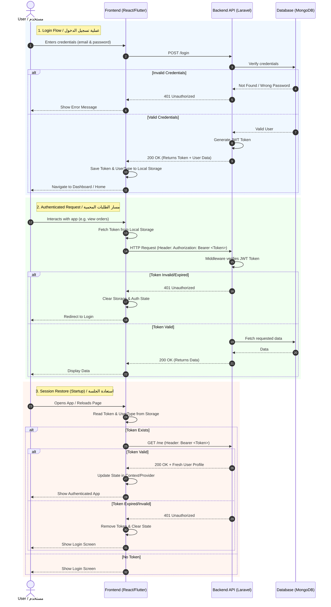

# Authentication System Documentation / وثيقة نظام المصادقة

This document explains the authentication flow for **Customers** and **Employees** across the Bookstore monorepo (Laravel API, React Web, and Flutter App).
تشرح هذه الوثيقة تدفق المصادقة **للعملاء (Customers)** و **الموظفين (Employees)** عبر أجزاء المشروع المختلفة (واجهة Laravel البرمجية، موقع React، وتطبيق Flutter).

---

## 🇬🇧 English

### Overview
The bookstore uses a **token-based authentication system** powered by JWT (JSON Web Tokens). There are two distinct types of users, meaning the system maintains two separate authentication guards:
1. **Customers**: End-users who browse books and place orders.
2. **Employees**: Staff members (managers, warehouse managers, shipping, etc.) who manage the store.

### 1. API Backend (Laravel)
The backend uses the `tymon/jwt-auth` package.
- **Guards**: Two guards are configured in Laravel: `customer` and `employee`.
- **Routes**:
  - `POST /api/v1/customers/login` & `POST /api/v1/customers/register`
  - `POST /api/v1/employees/login`
  - Protected routes use middleware like `auth:customer` or `auth:employee`.
- **Controllers**: Handled by `CustomerAuthController` and `EmployeeAuthController`. They verify credentials, generate a JWT token, and return it alongside the user's data.

### 2. Web Frontend (React)
The web application manages authentication state globally using React Context.
- **State Management**: `AuthContext.tsx` handles the user's session.
- **Storage**: Upon successful login, the application saves two values in the browser's `localStorage`:
  - `token`: The JWT token string.
  - `userType`: Either `'customer'` or `'employee'`.
- **API Interceptor**: Axios is configured in `web/src/lib/api.ts` with a request interceptor. Before any request is sent, it checks `localStorage` for a `token`. If found, it automatically appends the `Authorization: Bearer <token>` header to the request.
- **Session Persistence**: When the app loads, `AuthContext` checks `localStorage`. If a token exists, it automatically hits the `/me` endpoint corresponding to the `userType` to silently authenticate the user and fetch their latest data.

### 3. Mobile App (Flutter)
The Flutter mobile application uses Provider for state management and local storage for persistence.
- **State Management**: `AuthProvider` (`app/lib/providers/auth_provider.dart`) manages the auth state, maintaining variables for `_token`, `_customer`, `_employee`, and `_userType`.
- **Storage**: Upon login, it uses the `shared_preferences` package to securely save `token` and `userType` to the device storage.
- **API Client**: `api_client.dart` fetches the token from `SharedPreferences` and injects `Authorization: Bearer $token` into the HTTP headers for every request.
- **Session Persistence**: On app startup, `AuthProvider` calls `_loadStored()`, reads the stored token/type, and validates the session against the backend's `/me` endpoint. If the token is expired, the session is cleared.

---

## 🇸🇾 العربية (Arabic)

### نظرة عامة
تستخدم المكتبة **نظام مصادقة يعتمد على الرموز (Token-based)** يعمل بواسطة تقنية JWT (JSON Web Tokens). يوجد نوعان مختلفان من المستخدمين، مما يعني أن النظام يحتفظ بحارسي مصادقة (Guards) منفصلين:
1. **العملاء (Customers)**: المستخدمون النهائيون الذين يتصفحون الكتب ويقومون بإنشاء الطلبات.
2. **الموظفون (Employees)**: أعضاء فريق العمل (المدراء، مديرو المستودعات، موظفو الشحن، إلخ) الذين يديرون المتجر.

### 1. الواجهة البرمجية الخلفية (Laravel API)
تستخدم الواجهة الخلفية حزمة `tymon/jwt-auth`.
- **الحراس (Guards)**: تم تكوين حارسين في Laravel: `customer` و `employee`.
- **المسارات (Routes)**:
  - `POST /api/v1/customers/login` و `POST /api/v1/customers/register` للعملاء.
  - `POST /api/v1/employees/login` للموظفين.
  - تستخدم المسارات المحمية برمجيات وسيطة (Middleware) مثل `auth:customer` أو `auth:employee`.
- **وحدات التحكم (Controllers)**: تتم إدارتها بواسطة `CustomerAuthController` و `EmployeeAuthController`. تقوم هذه الوحدات بالتحقق من بيانات الدخول، إنشاء رمز JWT، وإرجاعه مع بيانات المستخدم.

### 2. واجهة الويب (React)
يدير تطبيق الويب حالة المصادقة بشكل عام باستخدام React Context.
- **إدارة الحالة**: يتعامل `AuthContext.tsx` مع جلسة المستخدم.
- **التخزين**: عند تسجيل الدخول بنجاح، يحفظ التطبيق قيمتين في `localStorage` الخاصة بالمتصفح:
  - `token`: سلسلة نصية تمثل رمز JWT.
  - `userType`: تحدد نوع المستخدم (إما `'customer'` أو `'employee'`).
- **المعترضات (API Interceptor)**: تمت تهيئة مكتبة Axios في `web/src/lib/api.ts` باستخدام معترض للطلبات (Request Interceptor). قبل إرسال أي طلب، يتم التحقق من وجود `token` في الـ `localStorage`. إذا وُجد، يتم تلقائياً إرفاق ترويسة `Authorization: Bearer <token>` مع الطلب.
- **استمرار الجلسة**: عند تحميل التطبيق، يتحقق `AuthContext` من التخزين المحلي. إذا وُجد الرمز، يقوم تلقائياً بطلب نقطة النهاية `/me` (حسب نوع المستخدم) لمصادقة المستخدم بصمت وجلب أحدث بياناته.

### 3. تطبيق الهاتف المحمول (Flutter)
يستخدم تطبيق الهاتف المحمول Provider لإدارة الحالة والتخزين المحلي لحفظ الجلسة.
- **إدارة الحالة**: يدير `AuthProvider` (`app/lib/providers/auth_provider.dart`) حالة المصادقة، حيث يحتفظ بمتغيرات لـ `_token`، `_customer`، `_employee`، و `_userType`.
- **التخزين**: عند تسجيل الدخول، يستخدم حزمة `shared_preferences` لحفظ `token` و `userType` بأمان في مساحة تخزين الجهاز.
- **عميل واجهة برمجة التطبيقات (API Client)**: يقوم `api_client.dart` بجلب الرمز من `SharedPreferences` ويقوم بحقن ترويسة `Authorization: Bearer $token` في كل طلب HTTP يتم إرساله.
- **استمرار الجلسة**: عند تشغيل التطبيق، يستدعي `AuthProvider` وظيفة `_loadStored()`، ويقرأ الرمز/النوع المخزن، ثم يتحقق من صلاحية الجلسة عبر طلب نقطة النهاية `/me` من الخادم. في حال انتهاء صلاحية الرمز، يتم مسح بيانات الجلسة.

---

## Visual Workflow Diagram / مخطط سير العمل

This Mermaid sequence diagram illustrates the lifecycle of authentication—from login to subsequent requests and session recovery on app reload.
يوضح مخطط التسلسل (Sequence Diagram) هذا دورة حياة المصادقة: بدءاً من تسجيل الدخول، وصولاً إلى الطلبات اللاحقة واستعادة الجلسة عند إعادة فتح التطبيق.

