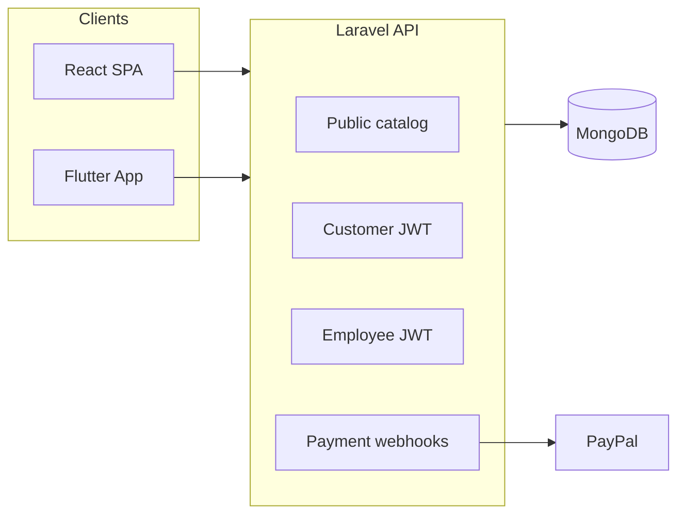

# Bookstore — مشروع المتجر الإلكتروني للكتب  
**Full-stack documentation (English overview + Arabic deep description)**

---

## 1. What this repository is

This monorepo powers an **online bookstore**: catalog browsing, shopping cart, multi-warehouse order splitting, customer and employee flows, administration, reporting hooks, and payment integrations (cash on delivery, Stripe webhook stub, PayPal Orders flow).

| Area | Path | Role |
|------|------|------|
| **REST API** | `api/` | Laravel 11, MongoDB, JWT; public catalog + customer cart/orders + admin/employee backends |
| **Web storefront & admin SPA** | `web/` | React 19 + Vite + TypeScript + TanStack Query + i18next (Arabic / English) |
| **Mobile app** | `app/` | Flutter — storefront, cart/checkout/orders; employees can submit warehouse quotes from Profile → Warehouse orders (`/employees/orders` API). |

**API base URL (typical development):** `http://localhost:8000/api/v1`  
**Static API notes:** see `api/public/docs.html` when `php artisan serve` is running.

---

## 2. Architecture (conceptual)



- **Single backend** serves both web and mobile (same JSON contracts).
- **MongoDB** stores books, categories, warehouses, carts, orders, payments, settings, etc.
- **JWT** distinguishes **customers** vs **employees** (separate guards and route groups).

---

## 3. Main features (product-level)

### Storefront (customers)

- Browse **books**, **categories**, **authors**, **warehouses** (public endpoints).
- **Registration / login**, profile, JWT refresh/logout.
- **Cart**: add/update/remove lines; totals.
- **Checkout**: shipping address, shipping and **payment method preferences** (COD / Stripe / PayPal per admin settings). Checkout creates order(s) in **`pending_warehouse_review`** with **payment pending**; stock is only reserved when fulfillment begins (see lifecycle below).
- **Orders**: list/detail; statuses that follow the warehouse–customer loop; payment status visibility.
- **PayPal**: after the warehouse has **quoted** the order (final line totals + shipping fee), the customer starts PayPal with **`order_ids`** from the quoted order(s) → approve on PayPal → return URL hits API (`GET /api/v1/paypal/complete`) to capture and mark orders paid; webhook `PAYMENT.CAPTURE.COMPLETED` aligns state when configured.

#### Order lifecycle (warehouse review → customer confirm → fulfillment)

1. **Customer** selects books, completes checkout: order(s) go to the warehouse as **`pending_warehouse_review`**, with chosen shipping and payment **preferences**.
2. **Warehouse staff** review, set/adjust pricing as needed, add **shipping fee**, and confirm shipping and payment method; order moves to **`awaiting_customer_confirmation`**.
3. **Customer** reviews the quote and **confirms** (or pays via PayPal when applicable), moving the order to **`resubmitted_to_warehouse`**.
4. Staff advance the order through **`processing_fulfillment`** → **`shipped_collecting_payment`** (package sent; payment collected per agreed method).
5. Order is marked **`completed`** (e.g. COD marked paid on completion from the shipped state).

**Legacy data:** older MongoDB documents may still store previous `status` strings; the API **normalizes** common legacy values when reading. For dashboards only showing new labels, consider a one-off migration to rewrite stored statuses.

### Administration & operations (employees)

- Role-aware routes: manager, shipping, review, accounting, employee, warehouse manager (with warehouse scoping where applied).
- **Books** CRUD, cover upload; **authors**; **categories**; **warehouses**.
- **Customers** management (including convert customer → employee).
- **Orders**: listing, assignment, status updates, and **warehouse quote** (subtotal, shipping fee, shipping/payment confirmation) while orders are **`pending_warehouse_review`**.
- **Settings**: site-wide options including **payment methods** (COD, Stripe, PayPal toggles/names).
- **Countries/cities** sync utilities; **reports** (e.g. books without covers); warehouse book browsing.

### Technical patterns (backend)

- **Repository + service layers**, Form Requests, domain interfaces for orders/cart/etc.
- **Rate limiting** on API group; **CORS** via env.
- Optional **MongoDB transactions** when replica set enabled (`MONGODB_TRANSACTIONS`).

---

## 4. Environment & running (quick reference)

Details and copy-paste commands are consolidated in the root **`README.md`**. Typical flow:

```bash
# API
cd api && cp .env.example .env && composer install && php artisan key:generate && php artisan jwt:secret && php artisan serve

# Web
cd web && npm install && npm run dev

# Flutter
cd app && flutter pub get && flutter run
```

**PayPal (API `.env`):** `PAYPAL_MODE`, `PAYPAL_CLIENT_ID`, `PAYPAL_CLIENT_SECRET`, `PAYPAL_RETURN_URL`, `PAYPAL_SUCCESS_REDIRECT`, `PAYPAL_CANCEL_REDIRECT`, `PAYPAL_CURRENCY` — see `api/.env.example` and `api/config/paypal.php`.

---

## 5. Localization

- **Web:** `web/src/i18n/` (`en.json`, `ar.json`) with `i18next`.
- **Mobile:** Flutter `lib/l10n` / ARB patterns as configured in the app.
- **API:** validates and stores multilingual catalog fields where models support EN/AR (e.g. category titles).

---

## 6. Security notes (operators)

- Never commit `.env` or JWT secrets / PayPal secrets.
- In production: verify **Stripe** and **PayPal** webhook signatures (controllers contain placeholders or partial logic — harden before go-live).
- Restrict `CORS_ALLOWED_ORIGINS` to real front-end origins.

---

# العربية — وصف معمَّق لمشروع متجر الكتب

## أولاً: الفكرة والهدف من المشروع

يمثِّل هذا المستودع **منظومة تجارة إلكترونية متخصصة في بيع الكتب**، بحيث يمكن للعميل **استعراض الكتالوج**، وإضافة الكتب إلى **سلة مشتريات**، وإتمام **عملية شراء** مع طرق دفع متعددة، بينما يدير الفريق الإداري والمستودعات **البيانات الأساسية** (الكتب، المؤلفون، التصنيفات، المستودعات) ويتابع **الطلبات** من مرحلة الاستلام حتى التحضير والشحن وحالات أخرى حسب سياسات المتجر المبرمجة في النظام.

الهدف التقني هو **فصل الواجهات عن المنطق**: واجهة ويب (**React**) وتطبيق جوال (**Flutter**) يشاركان **واجهة برمجية موحدة (Laravel API)** ومخزن بيانات واحد (**MongoDB**)، مع **توثيق باستخدام JWT** لتمييز **زائر مسجّل كعميل** عن **موظف بوابة الإدارة**.

---

## ثانياً: من يستخدم النظام؟

### 1) العميل (Customer)

- يتصفح الكتب والتصنيفات والمؤلفين والمستودعات دون الحاجة لحساب (جزء من المحتوى العام عبر نقاط النهاية العامة للـ API).
- ينشئ حسابًا أو يدخل بحسابه، يحدّث **عنوان الشحن** ومعلوماته.
- يدير **السلة** ويؤكد **عملية الشراء (Checkout)**.
- يتابع **الطلبات** وحالة كل طلب (بما فيها **حالة الدفع** إن وُجدت في الاستجابة).

### 2) الموظف / الإدارة (Employee — بأدوار متعددة)

- يدخل عبر بوابة موظفين منفصلة عن العملاء (مسارات وجداول صلاحيات مختلفة في الـ API).
- الدور يحدد ما يمكن رؤيته أو تعديله (مثل مدير، شحن، مراجعة، محاسبة، مشرف مستودع، إل.).
- يدير **الكتب** (مع رفع غلاف الكتاب)، **المؤلفين**، **التصنيفات**، **المستودعات**، **العملاء**، و**الطلبات** (عرض، تعيين، تحديث حالة).

بهذا الشكل يتحول المشروع من «موقع عرض كتب» إلى **منصة تشغيل متجر** تربط الزبائن بفريق الخلفية.

---

## ثالثاً: ماذا يميّز سلوك «الطلب» في هذا المتجر؟

### تقسيم الطلب حسب المستودع

النموذج البرمجي يدعم ربط **كل كتاب بمستودع**. عند إتمام الشراء، إذا احتوت السلة كتبًا من **أكثر من مستودع**، فإن النظام قد يُنشئ **أكثر من طلب** (طلبًا لكل مستودع)، مع **مجموع مالي** مستقل لكل طلب وتتبّع مخزون لكل مجموعة عناصر. هذه الآلية تُقرب النظام من واقع التشغيل حيث الشحن أو التجهيز يتم من مواقع مختلفة.

لهذا تجد في واجهة الدفع رسائل توضيحية للعميل (مثل تجميع العناصر حسب المستودع)، وهو أمر **وظيفي واضح للمستخدم النهائي** وليس مجرد تفاصيل تقنية.

### مسار الطلب من التأكيد حتى الإكمال (خمس مراحل)

1. **العميل** يختار الكتب ويُكمل الدفع: يُرسل الطلب إلى المستودع بحالة **بانتظار مراجعة المستودع**، مع اختيار **طريقة الشحن** و**تفضيل طريقة الدفع**.
2. **موظف المستودع** يراجع السلة، يثبّت الأسعار، يضيف **رسوم الشحن**، ويثبّت طريقة الشحن والدفع؛ تنتقل الحالة إلى **بانتظار تأكيد العميل**.
3. **العميل** يراجع العرض ويؤكد (أو يدفع عبر PayPal عند الاقتضاء) ثم يُعاد إرسال الطلب إلى المستودع.
4. يُجهّز الطلب ويُشحن، ويُحصّل الدفع بالطريقة المتفق عليها.
5. تُغلق الحالة كـ **مكتمل**.

**ملاحظة:** قد توجد في قاعدة البيانات قيم حالة قديمة؛ الـ API يحاول **توحيدها** عند القراءة. لعرض موحّد في لوحات التحكم يمكن لاحقًا تشغيل ترحيل لتحديث الحقول المخزّنة.

### طرق الدفع والإعدادات

تُدار **طرق الدفع المتاحة** من إعدادات المشرف (مثل الدفع عند الاستلام، بطاقة عبر Stripe، PayPal)، مع تمكين/تعطيل كل طريقة وعرض الاسم المعروض في الواجهة. ذلك يمنح صاحب المتجر مرونة بدون إعادة نشر التطبيق: يكفي ضبط الإعداد في لوحة الإدارة (حسب آلية التخزين في قاعدة البيانات).

**الدفع عند الاستلام (COD)** يُعامل في المنطق البرمجي كحالة دفع أكثر «مباشرة» بالنسبة لحالة الدفع عند الطلب، بينما الربط الإلكتروني (Stripe/PayPal) يعتمد على **عمليات مستقبلية** (callbacks / webhooks) لتحديث حالة الطلب بعد نجاح العملية من جهة بوابة الدفع.

---

## رابعاً: التكامل مع PayPal (باختصار مفيد للقارئ العربي)

- بعد أن يقدّم المستودع **عرض السعر النهائي** (بما في ذلك رسوم الشحن)، وعندما يختار العميل **PayPal**، يبدأ المسار من الـ API بإنشاء **أمر شراء على PayPal** للمبلغ المعتمد للطلب(ات) المحددة بمعرّفات **`order_ids`**، مع **`custom_id`** يربط تلك الطلبات.
- بعد موافقة المستخدم على PayPal، يعيد بوابة PayPal التوجيه إلى عنوان **عودة عام** على الـ API يقوم **بالمصادقة (Capture)** وتثبيت **الدفع** للطلبات المرتبطة.
- يوجد أيضًا مسار **Webhook** لتلقي إشعار اكتمال التحصيل من PayPal ومزامنة الحالة؛ في بيئة الإنتاج يُنصح بشدة بتفعيل **التحقق من التوقيع** لأن مسارات الويب هوك عمومًا حساسة.

---

## خامساً: البنية التقنية بلسان مختصر ومفصل

### الخادم الخلفي (Laravel + MongoDB)

- **PHP 8.2+** وإطار **Laravel 11**.
- اتصال **MongoDB عبر laravel-mongodb** مع هجرات وموديلات مخصّصة للمجموعات (collections).
- **JWT (tymon/jwt-auth)** لجلسات API للعميل والموظف.
- تنظيم الكود وفق طبقات: **طبقة HTTP (Controllers)**، **Form Requests للتحقق**، **Services**، **Repositories** وأحيانًا **Contracts / Domain Interfaces** لموديولات مثل الطلبات والسلة، بهدف **قابلية الصيانة وتوسعة المشروع**.
- مهام جانبية مثل استيراد بيانات (مثل جداول/ملفات) أو مزامنة بيانات جغرافية قد توجد ضمن أوامر (Console) حسب احتياج المتجر — والمبدأ أن قاعدة الـ API تبقى **كمركز حقيقة واحد** للبيانات.

### الواجهة الويب (React)

- تطبيق **صفحة واحدة (SPA)** بـ **Vite**.
- إدارة جلب الخادم وحالة الواجهة عبر **TanStack Query** مع **axios** للاتصال بالـ API.
- **التوجيه** عبر react-router؛ **التعدد اللغوي** عبر i18next مع ملفات JSON للعربية والإنجليزية؛ واستخدام Tailwind وفق الإعداد الحالي للمشروع.

### التطبيق الجوال (Flutter)

- عميل لمستخدمي الهواتف يعيد استخدام نفس نقاط النهاية.
- آلية شبكة مركزية (خدمة API) لتجميع الطلبات وإرفاق الرمز JWT من التخزين المحلي.
- تدفق الطلب يتبع نفس مسار الويب (مراجعة المستودع ثم تأكيد العميل؛ PayPal بعد عرض السعر). يمكن للعميل إكمال PayPal في المتصفح حسب إعدادات الـ API وروابط الإرجاع.
- يمكن لموظف المستودع تسجيل الدخول كـ **موظف** من شاشة الدخول، ثم من **الملف الشخصي → طلبات المستودع** إرسال **عرض المستودع** (رسوم الشحن وطرق الشحن والدفع) وتحديث الحالة عبر مسارات `/employees/orders` مثل لوحة الإدارة على الويب.

---

## سادساً: الأمان وممارسات التشغيل

- لا يُخزَّن على الخادم **رقم البطاقة الكامل** وفق أفضل الممارسات؛ الاعتماد يكون على **بوابات دفع خارجية**.
- تشغيل المتجر الإنتاجي يتطلّب: أسرار JWT قوية، أسرار PayPal و Stripe من بيئة **Live** المتطابقة، و**CORS** مقيدًا على نطاقات الويب الحقيقية، وفحص **سجلات Laravel** عند أي فشل في OAuth أو التقاط الدفع لمعرفة كود الخطأ القادم من PayPal بدل الاكتفاء برسالة عامة أمام الزبون.

---

## سابعاً: أين تجد أوامر التشغيل والتفاصيل الإضافية؟

راجع ملف **`README.md`** في جذر المستودع لأوامر التثبيت (`composer`، `npm`، `flutter`)، عنوان الـ API الافتراضي، وبذرة المستخدم الأولي بعد `db:seed` إذا وُجدت.

---

## ثامناً: خاتمة

هذا المشروع ليس مجرد ثلاثة مجلدات برمجية، بل **نظام متجر كتب متكامل** يراعي:

- تجربة **عميل** متعددة القنوات (ويب وجوال)،  
- **إدارة تشغيلية** للكتب والمستودعات والطلبات،  
- واقع **تشتيت المخزون** عبر أكثر من موقع للتجهيز أو الشحن،  
- وممرات **دفع** قابلة للتوسعة مع الالتزام بممارسات أمان معقولة.

الوصف أعلاه مخصّص لمن يبحث عن **فهم عميق بالعربية** لدوافع التصميم وسلوك النظام، بالإضافة إلى الملخص التقني الإنجليزي في بداية الملف للمطورين والمشرفين التقنيين.
