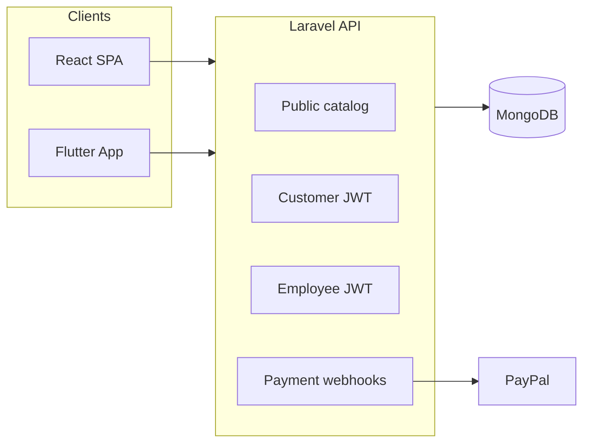

# Bookstore — Project Documentation

Full-stack online bookstore: catalog, cart, multi-warehouse orders, admin/ops, and payments (COD, Stripe webhook stub, PayPal).

> **This file is the single source of project documentation.**  
> Root / `web/` / `app/` READMEs only point here for setup shortcuts.

---

## 1. Repository layout

| Area | Path | Stack / role |
|------|------|----------------|
| **REST API** | `api/` | Laravel 11, MongoDB, JWT — public catalog, customer cart/orders, admin & employee APIs |
| **Web SPA** | `web/` | React 19 + Vite + TypeScript + TanStack Query + i18next (AR/EN) — storefront + admin |
| **Mobile** | `app/` | Flutter — storefront, cart/checkout/orders; staff warehouse quotes via employee API |

**API base (dev):** `http://localhost:8000/api/v1`  
**HTML API notes:** `http://localhost:8000/docs.html` when `php artisan serve` is running.



---

## 2. Product features

### Storefront (customers)

- Browse **books**, **categories**, **authors**, **warehouses**, **publishers** (public APIs).
- Book cards and book detail link to **publisher** (`/publishers/:id`) and **warehouse** (`/warehouses/:id`) book lists (web + Flutter).
- Register / login, profile, JWT refresh/logout.
- **Cart** and **checkout**: shipping address; payment methods from global settings **intersected** with each cart publisher’s allowed methods.
- Checkout creates order(s) in `pending_warehouse_review` with payment pending; stock is reserved when fulfillment starts.
- **Orders**: list/detail; quote confirmation; PayPal after warehouse quote when applicable.

### Order lifecycle

1. Customer checks out → `pending_warehouse_review` (preferences for shipping/payment).
2. Warehouse staff quote (prices, shipping fee, methods) → `awaiting_customer_confirmation`.
3. Customer confirms (or pays via PayPal) → `resubmitted_to_warehouse`.
4. Staff → `processing_fulfillment` → `shipped_collecting_payment`.
5. → `completed` (e.g. COD marked paid from shipped).

Legacy MongoDB status strings are normalized on read when possible. Multi-warehouse carts may split into **one order per warehouse**.

### Administration & operations (employees)

Roles: `manager`, `shipping`, `review`, `accounting`, `warehouse_manager`, `publisher_manager`, `direct_sales`.

| Capability | Notes |
|------------|--------|
| Books / authors / categories | CRUD; cover & author photo upload; employee quick-edit from public book/author pages |
| **Publishers** | CRUD; each publisher can own **multiple warehouses** |
| **Publisher settings** | Support contact, return policy, default discount, enabled payment methods, **payout accounts** (PayPal email / merchant ID, bank), and the **agreed project-management commission %** (manager-set; publisher can view) |
| Warehouses | Belong to a publisher; warehouse_manager scoped to assigned warehouse(s) |
| **Publisher manager** | Scoped to their publisher’s warehouses/books/employees/orders; can update own publisher settings |
| Customers / employees | Admin management; convert customer → employee; shipping and **direct sales** can have multiple warehouses |
| **Direct sales (POS)** | Walk-in invoices with optional customer name (no customer login). Staff pick books, create and print the invoice. Default catalog is the employee’s own warehouse; they may switch to other warehouses or publishers. Publisher managers, warehouse managers, and direct-sales staff can review invoices. Totals for **today**, **this month**, **this year**, and **all time** are always shown, plus a day/month/year breakdown. |
| Orders | List, assign, status, warehouse quote, bulk delete; shipping staff see fulfillment statuses; accounting sees all statuses |
| Settings | Global site options, payment methods, catalog items per page (default **25**) |
| Countries / reports | Sync utilities; books-without-cover report; browse books by warehouse |

### Payments

- Admin toggles COD / Stripe / PayPal globally.
- At checkout, methods = **global enabled ∩ all publishers in the cart**.
- Each publishing house stores its own payout accounts (PayPal email / merchant ID, bank). Customer PayPal payments are routed to that house when PayPal accepts the payee; otherwise the platform account collects and the split is still recorded.
- Project management’s commission is an agreed **percentage of book revenue** (not shipping), stored per publisher and snapshotted on each order and POS invoice (`platform_commission_*`, `publisher_payout_amount`).
- PayPal: after quote, `POST .../orders/paypal/start` with `order_ids` → approve → `GET /api/v1/paypal/complete`; webhook `PAYMENT.CAPTURE.COMPLETED` when configured.
- Env: `PAYPAL_*` — see `api/.env.example` and `api/config/paypal.php`.

---

## 3. Setup & run

### Requirements

- PHP 8.2+, Composer, MongoDB 4.4+
- PHP extensions: `mongodb`, `openssl`, `json`, `mbstring`, `tokenizer`, `xml`, `ctype`
- Node 18+ (web), Flutter SDK (mobile)

### API

```bash
cd api
cp .env.example .env
composer install
php artisan key:generate
php artisan jwt:secret
php artisan migrate
php artisan db:seed          # optional
php artisan serve            # or: php artisan serve --host=0.0.0.0 for devices
```

Set `MONGODB_URI` / `MONGODB_DATABASE`. For physical phones, serve on `0.0.0.0` and use the machine LAN IP in the Flutter config.

**Seed accounts (after `db:seed`):**

| Email | Password | Role |
|-------|----------|------|
| admin@bookstore.test | password | manager |
| manager@bookstore.test | password | manager |
| shipping@bookstore.test | password | shipping |
| warehouse-manager@bookstore.test | password | warehouse_manager |
| direct-sales@bookstore.test | password | direct_sales |

Demo POS invoices (named, walk-in, quantities, other warehouses, day/month/year): `php artisan db:seed --class=PosInvoiceSeeder`

### Web

```bash
cd web
npm install
npm run dev                  # http://localhost:5173 — /api proxied to :8000
```

Optional `.env`: `VITE_API_URL=http://localhost:8000/api/v1` (omit in dev to use Vite proxy).

```bash
npm run build
```

### Flutter

```bash
cd app
flutter pub get
# Set API URL in lib/config.dart:
#   Android emulator: http://10.0.2.2:8000/api/v1
#   iOS simulator:    http://localhost:8000/api/v1
#   Device:           http://YOUR_LAN_IP:8000/api/v1
flutter run
```

Android build notes: AGP **8.11.1**, Kotlin **2.2.20**, Gradle wrapper **8.14** (`app/android/`).

### CORS

```env
CORS_ALLOWED_ORIGINS=http://localhost:5173,https://app.example.com
# or * for local open access
```

---

## 4. API overview

### Response shape

```json
{
  "success": true,
  "message": "",
  "data": {}
}
```

Send JWT as `Authorization: Bearer <token>` (not Basic Auth).

### Public (no auth)

| Method | Path | Notes |
|--------|------|--------|
| GET | `/books` | Filters: `search`, `category_id`, `author_id`, `warehouse_id`, `publisher_id`, price, `in_stock` (default true). Always requires cover (`has_cover`). |
| GET | `/books/{id}` | Book detail + relations |
| GET | `/categories`, `/categories/{id}` | Dewey categories (show does **not** embed all books) |
| GET | `/authors`, `/authors/{id}` | Authors (show does **not** embed all books) |
| GET | `/warehouses`, `/warehouses/{id}` | Warehouses |
| GET | `/publishers/{id}` | Publisher detail for catalog links |
| GET | `/settings` | Public settings (e.g. global discount, payment method flags) |

### Customer auth & commerce

| Method | Path |
|--------|------|
| POST | `/customers/register`, `/customers/login` |
| GET/POST | `/customers/me`, `/customers/refresh`, `/customers/logout` |
| PUT | `/customers/profile` |
| GET/POST/DELETE | `/customers/cart`, `/customers/cart/items`, `/customers/cart/items/{bookId}` |
| POST | `/customers/orders/checkout`, `/customers/orders/paypal/start` |
| GET/POST | `/customers/orders`, `/customers/orders/{id}`, `/customers/orders/{id}/confirm-quote` |

### Employee auth & ops

| Method | Path |
|--------|------|
| POST | `/employees/login` |
| * | `/employees/me`, refresh, logout |
| * | `/employees/orders`… (warehouse quote for staff app) |
| * | `/admin/*` — books, warehouses, authors, categories, publishers (+ settings), employees, customers, orders, settings, countries, uploads |
| GET/POST | `/admin/pos/books`, `/admin/pos/invoices`, `/admin/pos/invoices/{id}`, `/admin/pos/reports` — walk-in invoices (`direct_sales`, warehouse/publisher managers, manager) |

Admin group middleware includes warehouse_manager / publisher_manager scoping.

### Payments / webhooks

- `POST /webhooks/stripe`, `POST /webhooks/paypal`
- `GET /paypal/complete`

### Postman / manual JWT testing

1. `POST {{baseUrl}}/customers/login` → copy `data.token`.
2. Protected calls: Authorization → **Bearer Token** (never Basic Auth).
3. Employees: `POST {{baseUrl}}/employees/login`, then Bearer for `/admin/...`.

Optional Postman test script after login:

```javascript
var json = pm.response.json();
if (json.success && json.data && json.data.token) {
  pm.environment.set("customer_token", json.data.token);
}
```

---

## 5. Domain model (core)

- **Publisher** → has many **Warehouses**; books have `publisher_id` + `warehouse_id`.
- **Book** → authors (`author_ids`), category, publisher, warehouse; `has_cover` boolean (maintained on save) for catalog filters.
- **Direct sale / POS invoice** — `is_direct_sale`, optional `customer_name` (no customer login), `employee_id` of the selling staff.
- **Settings** — global; publisher `settings` array for per-publisher options.

---

## 6. Performance & caching (large catalogs)

Designed for **100k+** books/authors:

| Technique | Detail |
|-----------|--------|
| **`has_cover` + compound index** | Public list: `has_cover` + in-stock + newest (`books_catalog_idx`) |
| **Cached pagination totals** | Book/author list totals cached ~10 min (versioned with catalog cache) |
| **Catalog page cache** | `CachedCatalogService` when `CACHE_CATALOG_ENABLED=true` |
| **Lean show endpoints** | Author/category show do not load all related books — clients use paginated `/books?author_id=` / `category_id=` |
| **Search** | Publisher name resolved via ID lookup (no heavy `orWhereHas`); author search is name-only |
| **Admin category counts** | One aggregation for `books_count` (no N+1 book list calls) |
| **Web QueryClient** | Default `staleTime` 60s; keep previous page data while paging |

```env
CACHE_STORE=file                 # prefer redis in production
CACHE_CATALOG_ENABLED=true
CACHE_CATEGORIES_TTL=3600
CACHE_AUTHORS_TTL=3600
CACHE_BOOKS_TTL=900
```

Invalidate catalog cache on book/author mutations (version bump).

---

## 7. Data import & load testing

### Import books from ODS

```bash
cd api && php artisan books:import-ods path/to/books.ods
```

- Requires at least one warehouse.
- Auto-detects columns (title, author, category, link/ISBN/price/stock, etc.).
- Optional cover scrape from product `link` (`--skip-cover` to skip).
- Useful flags: `--dry-run`, `--clear`, `--warehouse=ID`, `--title-col=0`, …

### Seed large datasets

```bash
cd api && php artisan db:seed-large --books=100000 --authors=100000 --chunk=5000
# or top up to a target total:
cd api && php artisan db:seed-large --target-books=1000000 --authors=0 --chunk=5000
```

Seeded books include placeholder covers and `has_cover=true` so they appear in the public catalog.

---

## 8. Testing

| Tool | Purpose |
|------|---------|
| PHPUnit 11 | Unit tests under `api/tests/Unit/` (no separate MongoDB test database) |

```bash
cd api
php artisan test --testsuite=Unit
```

Web: `npx tsc --noEmit`, ESLint as configured.  
Flutter: `dart analyze` / `flutter test`.

CI: GitHub Actions workflow under `.github/workflows/` (when present).

---

## 9. Localization

- **Web:** `web/src/i18n/en.json`, `ar.json` (i18next).
- **Mobile:** `app/lib/l10n`.
- **API:** bilingual category fields (`subject_title_en` / `subject_title_ar`) where applicable.

---

## 10. Security (operators)

- Never commit `.env`, JWT secrets, PayPal/Stripe secrets, or keystores.
- Production: verify Stripe/PayPal webhook signatures; restrict `CORS_ALLOWED_ORIGINS`.
- Harden payment controllers before go-live.

---

## 11. Backend patterns

- Controllers → Form Requests → Services → Repositories / domain interfaces.
- Middleware: `role:*`, `restrict.warehouse_manager`, `restrict.publisher_manager`, `throttle:60,1`.
- Optional MongoDB transactions when replica set enabled (`MONGODB_TRANSACTIONS`).

---

# العربية — وصف معمَّق

## الفكرة

منظومة تجارة إلكترونية لبيع الكتب: كتالوج، سلة، شراء متعدد المستودعات، إدارة تشغيلية، وطرق دفع (عند الاستلام / Stripe / PayPal). الواجهة الويب (React) وتطبيق الجوال (Flutter) يشتركان في **API موحّد (Laravel)** و**MongoDB**، مع JWT لفصل **العميل** عن **الموظف**.

## من يستخدم النظام؟

- **العميل:** تصفح (كتب، تصنيفات، مؤلفون، مستودعات، ناشرون)، سلة، دفع، متابعة طلبات.
- **الموظف:** أدوار متعددة (مدير، شحن، مراجعة، محاسبة، مشرف مستودع، **مدير ناشر**). إدارة كتب/مؤلفين/تصنيفات/**ناشرين**/مستودعات/عملاء/طلبات وإعدادات.

## سلوك الطلب

- كل كتاب مرتبط بمستودع وناشر. السلة من عدة مستودعات قد تُقسَّم إلى عدة طلبات.
- مسار: مراجعة المستودع → عرض سعر → تأكيد العميل → تجهيز → شحن → إكمال.
- طرق الدفع عند الدفع = تقاطع الإعدادات العامة مع إعدادات **كل ناشر** في السلة.
- لكل دار نشر حسابات تحصيل خاصة (مثل PayPal). عمولة إدارة المشروع نسبة متفق عليها من إيراد الكتب وتُحفظ على الطلب.

## الأداء على بيانات كبيرة

- فهرسة وفهرس مركّب للكتالوج، حقل `has_cover`، تخزين مؤقت للمجاميع والصفحات، وعدم تحميل كل كتب المؤلف/التصنيف في صفحة التفاصيل.

## التشغيل

راجع قسم **Setup & run** أعلاه لأوامر `composer` / `npm` / `flutter`، وحسابات البذرة، وروابط الـ API.

---

*Last updated to match publisher payout accounts, platform commission, publishers, publisher managers, catalog performance work, publisher/warehouse links, and current API surface.*
